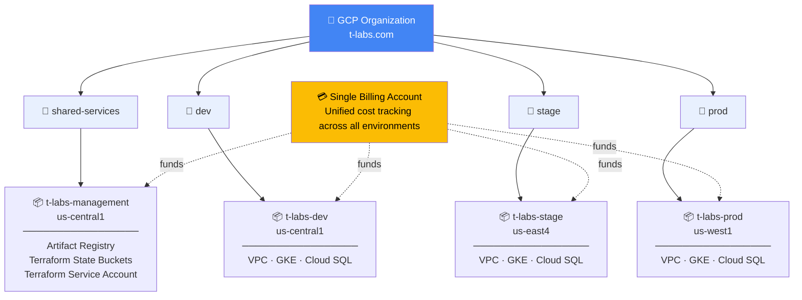
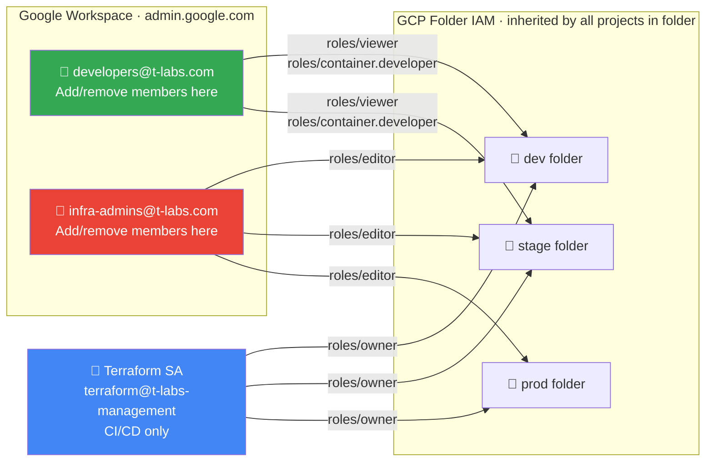
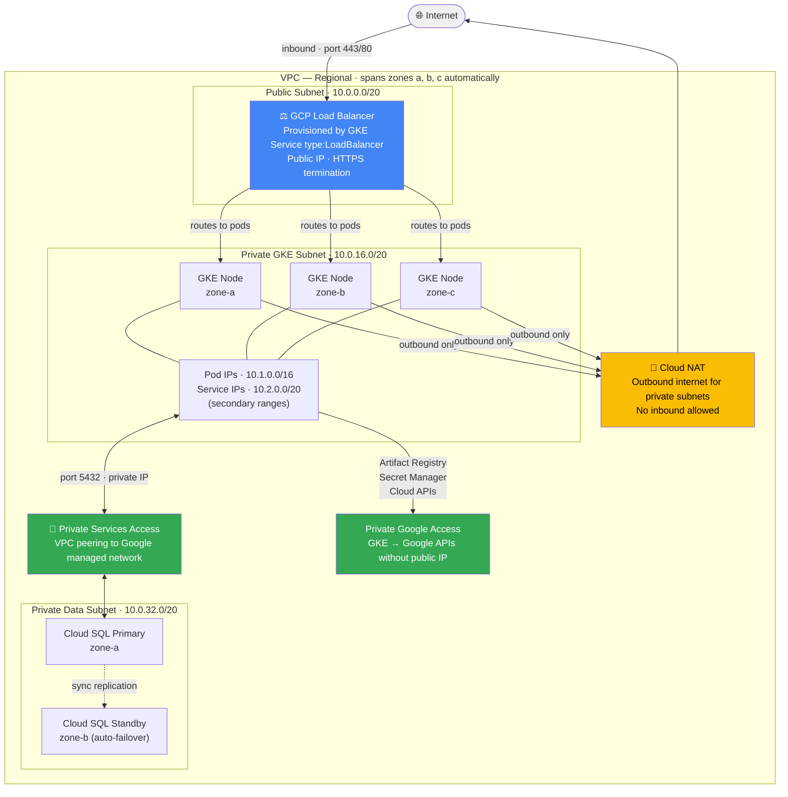
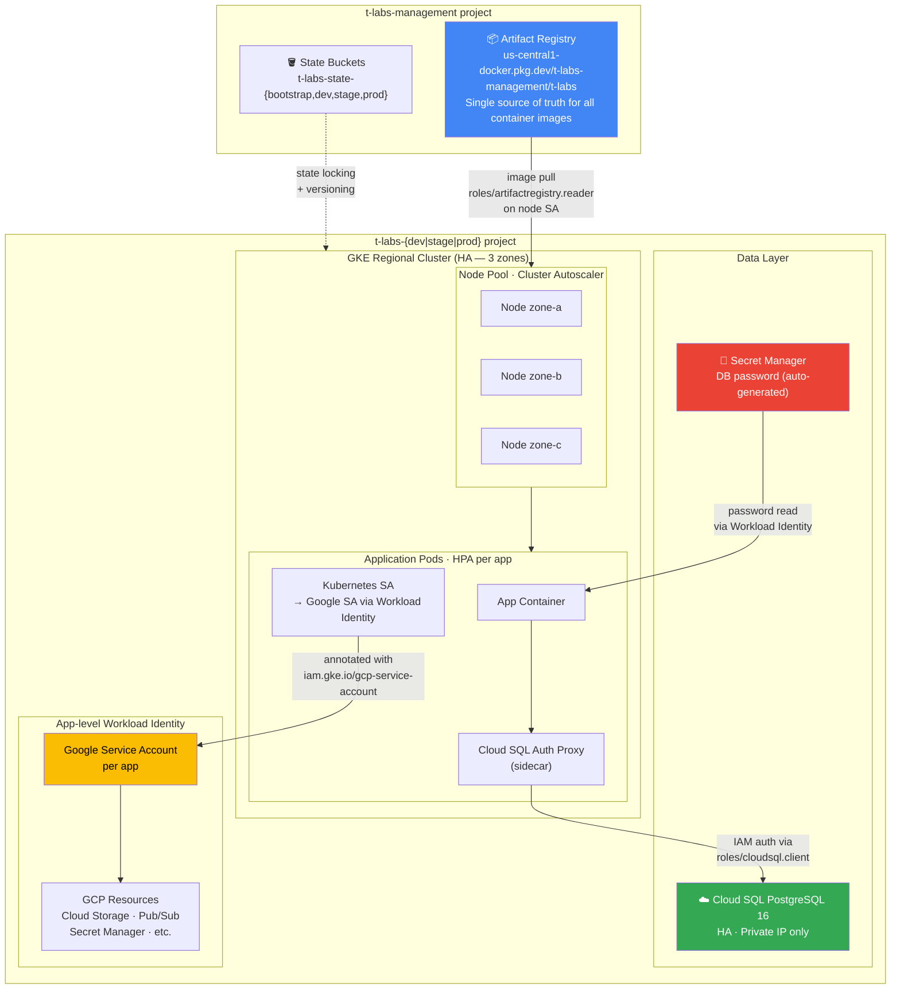

# t-labs Infrastructure

Terraform infrastructure for the t-labs platform on GCP. Manages a full multi-environment platform — dev, stage, and prod — each with its own isolated GCP project, VPC, GKE cluster, and managed PostgreSQL database. All environments are provisioned from a single set of reusable Terraform modules and share a central management project for state storage and container images.

---

## Architecture Overview

### GCP Organization Structure



Each environment is a fully isolated GCP project in its own folder — network misconfigurations, IAM changes, and cost overruns in one environment cannot affect another. All projects share a single billing account for unified cost visibility.

---

### IAM & Access Control



Access is managed entirely through Google Workspace groups — adding or removing a user from a group takes effect immediately with no Terraform change required. Developers have no access to the prod folder.

**State bucket access** mirrors the same boundary: developers can read dev/stage state (for debugging) but have no access to the prod state bucket.

---

### Network Architecture (per environment)

> CIDRs shown are for dev. Stage uses `10.10.x.x`, prod uses `10.20.x.x`.



Private subnets have no public IPs. Outbound internet access goes through Cloud NAT. Cloud SQL is accessible only via Private Services Access (VPC peering) — there is no public endpoint. GKE nodes reach Google APIs (Artifact Registry, Secret Manager, etc.) via Private Google Access without traversing the public internet.

---

### Application Infrastructure



---

## Repository Structure

```
t-labs/
├── bootstrap/                  # Run once — provisions org, projects, state buckets, IAM
│   ├── main.tf                 # Org folders + projects + API enablement
│   ├── gcs.tf                  # 4 state buckets (one per env)
│   ├── artifact_registry.tf    # Shared Docker registry in management project
│   ├── iam.tf                  # Terraform SA + Google Group IAM bindings
│   ├── providers.tf
│   ├── variables.tf
│   ├── outputs.tf
│   └── terraform.tfvars        # gitignored — contains org_id, billing account
│
├── modules/
│   ├── vpc/                    # VPC, 3 subnets, Cloud NAT, Private Services Access
│   ├── gke/                    # Regional GKE cluster, autoscaling node pool, Workload Identity
│   └── cloudsql/               # HA PostgreSQL 16, private IP, password → Secret Manager
│
└── environments/
    ├── dev/                    # us-central1 · small sizing · deletion_protection=false
    ├── stage/                  # us-east4   · medium sizing
    └── prod/                   # us-west1   · large sizing · deletion_protection=true
```

---

## Environment Comparison

| | dev | stage | prod |
|--|-----|-------|------|
| **Region** | `us-central1` | `us-east4` | `us-west1` |
| **GCP Project** | `t-labs-dev` | `t-labs-stage` | `t-labs-prod` |
| **VPC CIDR** | `10.0.0.0/16` | `10.10.0.0/16` | `10.20.0.0/16` |
| **GKE Master CIDR** | `172.16.0.0/28` | `172.16.1.0/28` | `172.16.2.0/28` |
| **GKE Node Type** | `e2-standard-2` | `e2-standard-4` | `e2-standard-8` |
| **GKE Nodes (min→max)** | 1→3 per zone | 1→5 per zone | 2→10 per zone |
| **Cloud SQL Tier** | `db-g1-small` | `db-n1-standard-2` | `db-n1-standard-4` |
| **Deletion Protection** | ✗ | ✗ | ✓ |
| **State Bucket** | `t-labs-state-dev` | `t-labs-state-stage` | `t-labs-state-prod` |

---

## Prerequisites

| Requirement | Notes |
|-------------|-------|
| GCP Organization | `t-labs.com` — set `org_id` in `bootstrap/terraform.tfvars` |
| GCP Billing Account | set `billing_account_id` in `bootstrap/terraform.tfvars` |
| Terraform `>= 1.8` | `brew install terraform` |
| gcloud CLI | `brew install --cask google-cloud-sdk` |
| Org Admin role | Required to run bootstrap |

---

## Getting Started

### 1. Authenticate

```bash
gcloud auth login
gcloud auth application-default login
```

### 2. Create Google Workspace groups

In [admin.google.com](https://admin.google.com) → Directory → Groups, create:
- `developers@t-labs.com`
- `infra-admins@t-labs.com`

### 3. Bootstrap (run once)

```bash
cd bootstrap
terraform init
terraform plan
terraform apply

# Migrate bootstrap state into GCS
terraform init -migrate-state \
  -backend-config="bucket=$(terraform output -raw state_bucket_bootstrap)"
```

### 4. Provision an environment

```bash
cd environments/dev
terraform init -backend-config="bucket=$(cd ../../bootstrap && terraform output -raw state_bucket_dev)"
terraform plan
terraform apply
```

Repeat for `stage` and `prod` in order, substituting `state_bucket_stage` / `state_bucket_prod`.

### 5. Connect to the cluster

```bash
# Replace ENV with dev / stage / prod and REGION with the environment's region
gcloud container clusters get-credentials t-labs-${ENV}-gke \
  --region ${REGION} \
  --project t-labs-${ENV}

kubectl get nodes
```

### 6. Push images to Artifact Registry

```bash
gcloud auth configure-docker us-central1-docker.pkg.dev

docker tag myapp us-central1-docker.pkg.dev/t-labs-management/t-labs/myapp:latest
docker push us-central1-docker.pkg.dev/t-labs-management/t-labs/myapp:latest
```

---

## Module Reference

### `modules/vpc`

| Input | Description |
|-------|-------------|
| `public_subnet_cidr` | CIDR for public subnet (load balancer IPs) |
| `private_gke_subnet_cidr` | CIDR for GKE nodes |
| `private_data_subnet_cidr` | CIDR for Cloud SQL |
| `pods_cidr` | Secondary range for pod IPs |
| `services_cidr` | Secondary range for service IPs |

Key outputs: `vpc_id`, `private_gke_subnet_id`, `private_services_connection_id`

### `modules/gke`

| Input | Description |
|-------|-------------|
| `master_cidr` | `/28` CIDR for GKE control plane (must not overlap VPC) |
| `master_authorized_networks` | CIDRs that can reach the API server |
| `machine_type` | Node VM size |
| `min_node_count` / `max_node_count` | Cluster Autoscaler bounds (per zone) |
| `deletion_protection` | Set `true` for prod |

Key outputs: `cluster_name`, `node_service_account_email`, `workload_identity_pool`

### `modules/cloudsql`

| Input | Description |
|-------|-------------|
| `tier` | Cloud SQL machine tier |
| `database_name` | Database to create |
| `deletion_protection` | Set `true` for prod |

Key outputs: `instance_connection_name`, `db_password_secret_id`

---

## Wiring Workload Identity for an App

For apps that need to talk to GCP resources (Cloud Storage, Pub/Sub, etc.):

```hcl
# 1. Create a Google Service Account for the app
resource "google_service_account" "my_app" {
  account_id = "my-app"
  project    = var.project_id
}

# 2. Grant it the GCP permissions it needs
resource "google_project_iam_member" "my_app_storage" {
  project = var.project_id
  role    = "roles/storage.objectViewer"
  member  = "serviceAccount:${google_service_account.my_app.email}"
}

# 3. Allow the Kubernetes ServiceAccount to impersonate it
resource "google_service_account_iam_member" "my_app_wi" {
  service_account_id = google_service_account.my_app.name
  role               = "roles/iam.workloadIdentityUser"
  member             = "serviceAccount:${var.project_id}.svc.id.goog[my-namespace/my-app]"
}
```

Then annotate the Kubernetes ServiceAccount:

```yaml
apiVersion: v1
kind: ServiceAccount
metadata:
  name: my-app
  namespace: my-namespace
  annotations:
    iam.gke.io/gcp-service-account: my-app@t-labs-dev.iam.gserviceaccount.com
```

---

## Common Operations

```bash
# Check what's in state
terraform state list

# Get Cloud SQL connection name (for Auth Proxy config)
terraform output cloudsql_instance_connection_name

# Get DB password from Secret Manager
gcloud secrets versions access latest \
  --secret=$(terraform output -raw db_password_secret_id) \
  --project=t-labs-dev

# Tear down dev environment
cd environments/dev && terraform destroy
```

---

## Key Design Decisions

- **One GCP project per environment** — full network and IAM blast radius isolation; a misconfiguration in dev cannot touch prod
- **Google Workspace Groups for IAM** — no Workforce Identity Federation needed since the org is on Google Workspace; group membership changes propagate to GCP immediately
- **Regional GKE cluster** — control plane and nodes distributed across 3 zones; no single zone failure can take down the cluster
- **GKE Cluster Autoscaler + HPA** — Cluster Autoscaler scales nodes (VMs); apps configure Horizontal Pod Autoscaler independently for pod-level scaling
- **Cloud SQL private IP only** — no public endpoint; accessible only via Private Services Access from within the VPC; password never leaves GCP (stored in Secret Manager)
- **Non-overlapping VPC CIDRs across environments** — dev `10.0.x`, stage `10.10.x`, prod `10.20.x`; safe to peer in future without renumbering
- **Separate GCS state bucket per environment** — prod state is inaccessible to developers; destroying one bucket cannot affect other environments' state
- **Single shared Artifact Registry** — images are built and pushed once, then promoted across environments by referencing the same digest; no per-env image rebuilds
