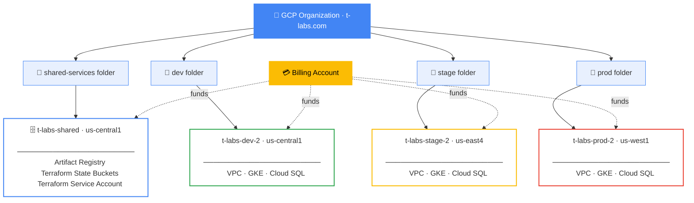
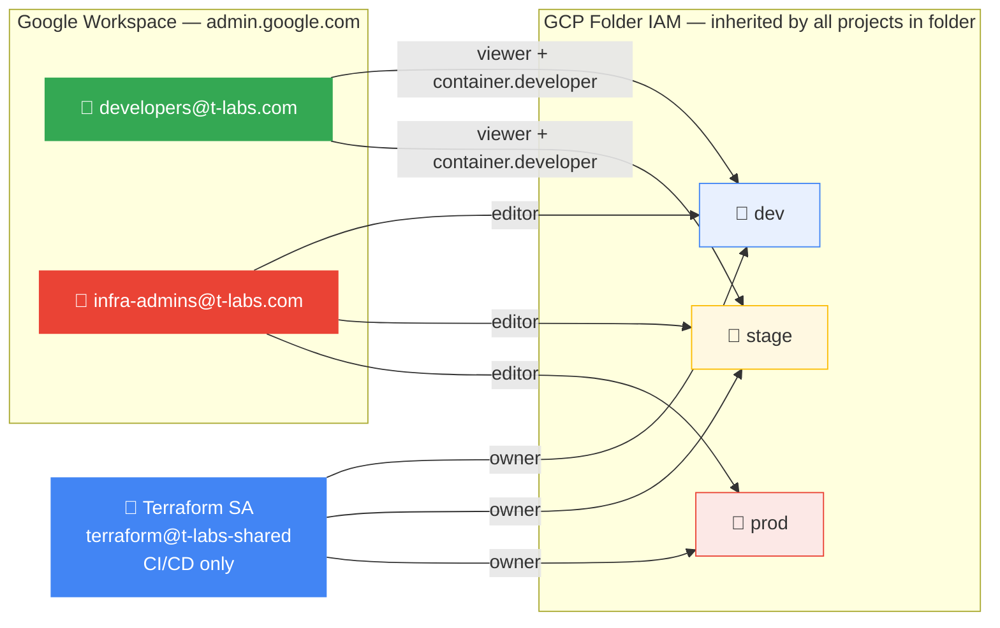
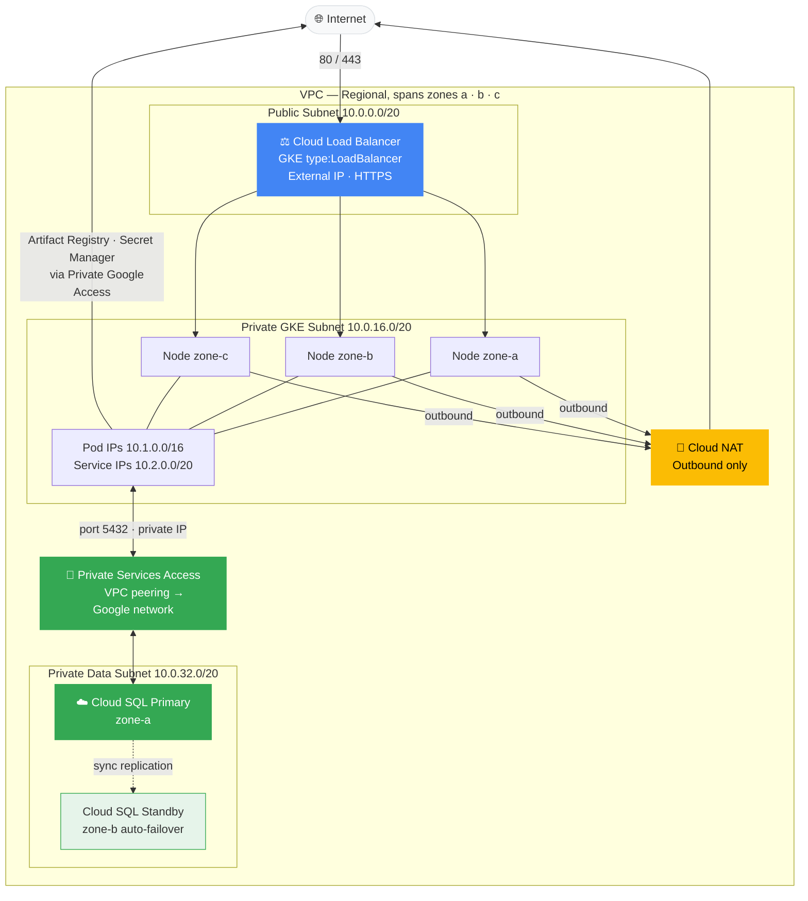
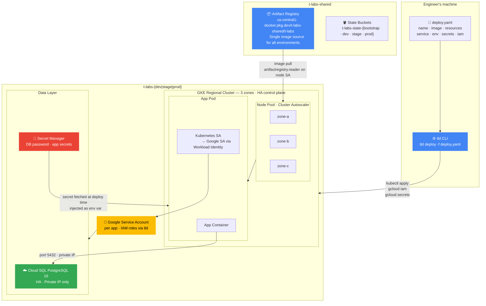
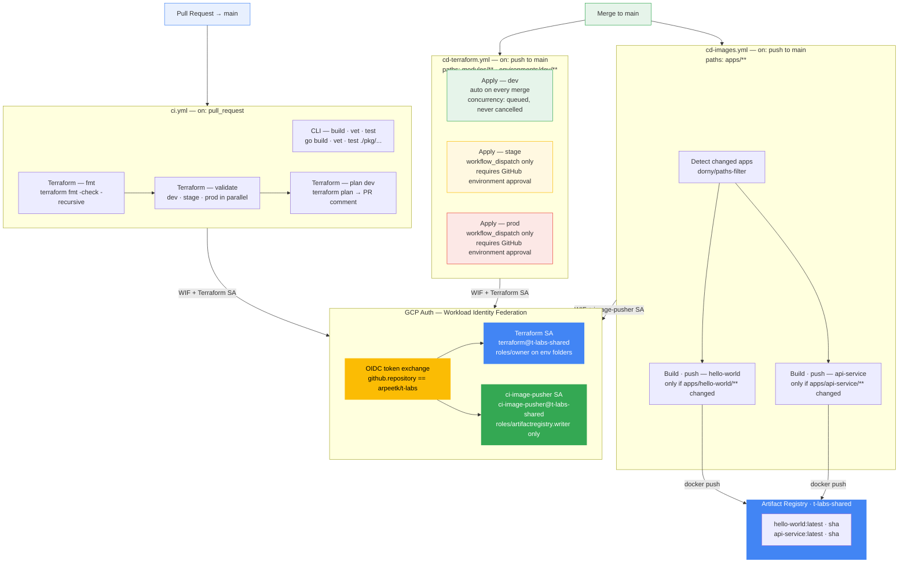

# t-labs Infrastructure

Terraform infrastructure and deployment tooling for the t-labs platform on GCP. Manages a full multi-environment platform — dev, stage, and prod — each with its own isolated GCP project, VPC, GKE cluster, and managed PostgreSQL database. A companion CLI (`tld`) lets engineers deploy containerised services from a single YAML manifest without writing any Kubernetes or GCP configuration.

---

## Architecture Overview

### GCP Organization Structure



Each environment lives in a fully isolated GCP project in its own folder. Network misconfigurations, IAM changes, and cost overruns in one environment cannot affect another.

---

### IAM & Access Control



Adding or removing a user from a Google Workspace group takes effect immediately — no Terraform change required. Developers have no access to the prod folder or prod state bucket.

---

### Network Architecture (per environment)

> CIDRs shown for dev. Stage uses `10.10.x.x`, prod uses `10.20.x.x`.



Cloud SQL has no public endpoint. GKE pods connect directly on port 5432 over the private VPC via Private Services Access — no proxy required.

---

### Application Deployment Architecture



---

### CI / CD Architecture

Three GitHub Actions workflows run on every change. All GCP authentication uses Workload Identity Federation — no long-lived service account keys are stored anywhere.



**Workflow summary**

| Workflow | Trigger | What it does |
|----------|---------|--------------|
| `ci.yml` | Pull request to `main` | Builds and tests the CLI; checks Terraform formatting; validates all three environment configs; runs `terraform plan` on dev and posts the output as a PR comment |
| `cd-terraform.yml` | Push to `main` (paths: `modules/**`, `environments/dev/**`) | Auto-applies dev on every merge; stage and prod require a manual `workflow_dispatch` with GitHub environment protection (required reviewers) |
| `cd-images.yml` | Push to `main` (paths: `apps/**`) | Detects which apps changed; rebuilds and pushes only those images — tagged `:latest` and `:<sha>` |

**Security decisions**

- **No stored credentials** — GitHub Actions exchanges its OIDC token for a short-lived GCP access token via WIF; the token is masked before being written to `GITHUB_ENV`
- **Least-privilege image SA** — `ci-image-pusher` has only `roles/artifactregistry.writer` on the t-labs registry; a compromised Docker build context cannot escalate to infrastructure
- **Saved plan in CD** — `cd-terraform.yml` runs `plan -out=tfplan` then `apply tfplan`; the apply is bounded to the reviewed plan and cannot diverge if state changes between steps
- **Concurrency groups** — Terraform apply jobs use `cancel-in-progress: false`; concurrent merges queue rather than race
- **Dev auto-apply, stage/prod gated** — only `environments/dev/**` and `modules/**` changes trigger auto-apply; stage and prod changes require a deliberate `workflow_dispatch` and pass through GitHub environment protection rules

---

## The `tld` CLI

`tld` translates a YAML manifest into GKE deployments. Engineers describe what their service needs; `tld` handles namespaces, GCP service accounts, Workload Identity, secret injection, and rollout waiting.

### Install

```bash
cd cli
make install       # builds and copies tld to /usr/local/bin
```

### Manifest format

```yaml
name: my-service           # lowercase letters, digits, hyphens · 6-30 chars (GCP SA limit)
environment: dev           # dev | stage | prod

image: us-central1-docker.pkg.dev/t-labs-shared/t-labs/my-service:latest
replicas: 2

resources:
  cpu: "500m"
  memory: "512Mi"

service:
  type: public             # public = LoadBalancer (external IP) | private = ClusterIP
  port: 8080

env:
  - name: ENV
    value: "dev"

secrets:
  - envVar: DB_PASSWORD    # env var name injected into the container
    secret: my-db-secret   # Secret Manager secret ID

iam:
  roles:
    - roles/secretmanager.secretAccessor
    # add any GCP IAM roles your service needs
```

### Commands

```bash
# Deploy (or re-deploy) a service
export TLD_DEV_PROJECT=t-labs-dev-2
tld deploy -f deploy.yaml

# Check rollout status
tld status -f deploy.yaml

# Remove all Kubernetes and GCP resources for a service
tld delete -f deploy.yaml
```

`tld deploy` provisions in this order:
1. Configures `kubectl` context for the target cluster
2. Creates the Kubernetes namespace if missing
3. Creates a Google Service Account and grants the declared IAM roles (if `iam.roles` is set)
4. Binds the GCP SA to the Kubernetes SA via Workload Identity
5. Fetches secrets from Secret Manager and creates a Kubernetes Secret
6. Applies the rendered Deployment, Service, and ServiceAccount manifests
7. Waits for the rollout to complete (`--timeout=5m`)

### Environment variables

| Variable | Description |
|----------|-------------|
| `TLD_DEV_PROJECT` | GCP project ID for dev (default: auto-detected via gcloud) |
| `TLD_STAGE_PROJECT` | GCP project ID for stage |
| `TLD_PROD_PROJECT` | GCP project ID for prod |
| `TLD_REGION` | Override the default region for an environment |

### Connecting to Cloud SQL

Cloud SQL is accessible via private IP within the VPC — no proxy sidecar needed. Set `DB_HOST` to the private IP from Terraform output:

```bash
# Get the private IP for your environment
terraform output cloudsql_private_ip    # run from environments/dev/

# Add to your deploy.yaml
env:
  - name: DB_HOST
    value: "10.241.220.2"
  - name: DB_USER
    value: "appuser"
  - name: DB_NAME
    value: "mydb"
secrets:
  - envVar: DB_PASSWORD
    secret: t-labs-dev-db-password
iam:
  roles:
    - roles/secretmanager.secretAccessor
```

### Building and pushing images

```bash
# Build with local Docker
docker build -t us-central1-docker.pkg.dev/t-labs-shared/t-labs/my-service:latest .
docker push us-central1-docker.pkg.dev/t-labs-shared/t-labs/my-service:latest

# Build with Cloud Build (use this if local Docker Hub is unreachable)
gcloud builds submit \
  --project=t-labs-shared \
  --tag=us-central1-docker.pkg.dev/t-labs-shared/t-labs/my-service:latest \
  .
```

---

## Repository Structure

```
t-labs/
├── bootstrap/                  # Run once — org, projects, state buckets, IAM
│   ├── main.tf
│   ├── gcs.tf
│   ├── artifact_registry.tf
│   ├── iam.tf
│   └── terraform.tfvars        # gitignored — org_id + billing_account_id
│
├── modules/
│   ├── vpc/                    # VPC, 3 subnets, Cloud NAT, Private Services Access
│   ├── gke/                    # Regional GKE cluster, autoscaling node pool, Workload Identity
│   └── cloudsql/               # HA PostgreSQL 16, private IP only, password → Secret Manager
│
├── environments/
│   ├── dev/                    # us-central1 · small sizing · deletion_protection=false
│   ├── stage/                  # us-east4   · medium sizing
│   └── prod/                   # us-west1   · large sizing · deletion_protection=true
│
├── cli/                        # tld CLI source (Go)
│   ├── cmd/                    # cobra commands: deploy, delete, status
│   ├── pkg/deployer/           # GCP + kubectl orchestration + K8s manifest template
│   └── pkg/manifest/           # YAML schema, parser, validator
│
└── apps/
    ├── hello-world/            # Sample public HTTP service
    └── api-service/            # Sample private service with Cloud SQL + Secret Manager
```

---

## Environment Comparison

| | dev | stage | prod |
|--|-----|-------|------|
| **Region** | `us-central1` | `us-east4` | `us-west1` |
| **GCP Project** | `t-labs-dev-2` | `t-labs-stage-2` | `t-labs-prod-2` |
| **VPC CIDR** | `10.0.0.0/16` | `10.10.0.0/16` | `10.20.0.0/16` |
| **GKE Master CIDR** | `172.16.0.0/28` | `172.16.1.0/28` | `172.16.2.0/28` |
| **GKE Node Type** | `e2-standard-2` | `e2-standard-4` | `e2-standard-8` |
| **GKE Nodes (min→max)** | 1→3 per zone | 1→5 per zone | 2→10 per zone |
| **Cloud SQL Tier** | `db-custom-1-3840` | `db-custom-2-7680` | `db-custom-4-15360` |
| **Deletion Protection** | ✗ | ✗ | ✓ |
| **State Bucket** | `t-labs-state-dev` | `t-labs-state-stage` | `t-labs-state-prod` |

---

## Prerequisites

| Requirement | Notes |
|-------------|-------|
| GCP Organization | Set `org_id` in `bootstrap/terraform.tfvars` |
| GCP Billing Account | Set `billing_account_id` in `bootstrap/terraform.tfvars` |
| Terraform `>= 1.8` | `brew install terraform` |
| gcloud CLI | `brew install --cask google-cloud-sdk` |
| kubectl | `gcloud components install kubectl` |
| gke-gcloud-auth-plugin | `gcloud components install gke-gcloud-auth-plugin` |
| Go `>= 1.17` | Required to build the `tld` CLI |
| Org Admin role | Required to run bootstrap |

---

## Getting Started

### 1. Authenticate

The org policy blocks `gcloud auth application-default login`. Use a short-lived access token instead:

```bash
gcloud auth login --account=you@your-org.com

# Set this before every Terraform or tld session
export GOOGLE_OAUTH_ACCESS_TOKEN=$(gcloud auth print-access-token --account=you@your-org.com)
export GOOGLE_APPLICATION_CREDENTIALS=""
```

### 2. Create Google Workspace groups

In [admin.google.com](https://admin.google.com) → Directory → Groups, create:
- `developers@t-labs.com`
- `infra-admins@t-labs.com`

### 3. Bootstrap (run once)

```bash
cd bootstrap
terraform init
terraform plan
terraform apply

# Migrate bootstrap state into GCS
terraform init -migrate-state \
  -backend-config="bucket=$(terraform output -raw state_bucket_bootstrap)"
```

### 4. Provision an environment

```bash
cd environments/dev
terraform init -backend-config="bucket=t-labs-state-dev"
terraform plan
terraform apply
```

Repeat for `stage` and `prod`, substituting the bucket name.

### 5. Install the CLI

```bash
cd cli
make install    # installs tld to /usr/local/bin
```

### 6. Deploy a service

```bash
export TLD_DEV_PROJECT=t-labs-dev-2
export USE_GKE_GCLOUD_AUTH_PLUGIN=True

tld deploy -f apps/hello-world/deploy.yaml
tld status -f apps/hello-world/deploy.yaml
```

### 7. Push your own images

```bash
gcloud auth configure-docker us-central1-docker.pkg.dev

docker tag myapp us-central1-docker.pkg.dev/t-labs-shared/t-labs/myapp:latest
docker push us-central1-docker.pkg.dev/t-labs-shared/t-labs/myapp:latest
```

---

## Module Reference

### `modules/vpc`

| Input | Description |
|-------|-------------|
| `public_subnet_cidr` | CIDR for public subnet (load balancer frontend IPs) |
| `private_gke_subnet_cidr` | CIDR for GKE nodes |
| `private_data_subnet_cidr` | CIDR for Cloud SQL |
| `pods_cidr` | Secondary range for pod IPs |
| `services_cidr` | Secondary range for Kubernetes service IPs |

Key outputs: `vpc_id`, `private_gke_subnet_id`

### `modules/gke`

| Input | Description |
|-------|-------------|
| `master_cidr` | `/28` CIDR for the GKE control plane (must not overlap VPC) |
| `master_authorized_networks` | CIDRs allowed to reach the API server |
| `machine_type` | Node VM size |
| `min_node_count` / `max_node_count` | Cluster Autoscaler bounds (per zone) |
| `deletion_protection` | Set `true` for prod |

Key outputs: `cluster_name`, `node_service_account_email`, `workload_identity_pool`

### `modules/cloudsql`

| Input | Description |
|-------|-------------|
| `tier` | Machine tier — must be `db-custom-<cpu>-<memorymb>` format |
| `database_name` | Database to create |
| `db_user` | Application database username (default: `appuser`) |
| `deletion_protection` | Set `true` for prod |

Key outputs: `instance_connection_name`, `private_ip_address`, `db_password_secret_id`

---

## Wiring Workload Identity for an App

For apps that need GCP resource access (Cloud Storage, Pub/Sub, etc.), declare the roles in `deploy.yaml` — `tld` handles SA creation and binding automatically:

```yaml
iam:
  roles:
    - roles/storage.objectViewer
    - roles/pubsub.publisher
```

To wire it manually in Terraform instead:

```hcl
resource "google_service_account" "my_app" {
  account_id = "my-app"
  project    = var.project_id
}

resource "google_project_iam_member" "my_app_storage" {
  project = var.project_id
  role    = "roles/storage.objectViewer"
  member  = "serviceAccount:${google_service_account.my_app.email}"
}

resource "google_service_account_iam_member" "my_app_wi" {
  service_account_id = google_service_account.my_app.name
  role               = "roles/iam.workloadIdentityUser"
  member             = "serviceAccount:${var.project_id}.svc.id.goog[my-namespace/my-app]"
}
```

---

## Common Operations

```bash
# Check deployed services
tld status -f deploy.yaml

# Re-deploy after a config or image change
tld deploy -f deploy.yaml

# Remove a service and its GCP resources
tld delete -f deploy.yaml

# Run unit tests for the CLI
cd cli && go test ./pkg/...

# Inspect Terraform state
terraform state list

# Get Cloud SQL private IP (needed for DB_HOST in deploy.yaml)
terraform output cloudsql_private_ip

# Fetch the DB password from Secret Manager
gcloud secrets versions access latest \
  --secret=$(terraform output -raw db_password_secret_id) \
  --project=t-labs-dev-2

# Connect to the cluster directly
export USE_GKE_GCLOUD_AUTH_PLUGIN=True
gcloud container clusters get-credentials t-labs-dev-gke \
  --region us-central1 --project t-labs-dev-2

# Tear down an environment
cd environments/dev && terraform destroy
```

---

## Key Design Decisions

- **One GCP project per environment** — full network and IAM blast-radius isolation; a misconfiguration in dev cannot touch prod
- **`tld` CLI over raw kubectl/gcloud** — engineers describe what their service needs (image, resources, secrets, IAM roles) in one YAML file; the CLI handles all Kubernetes and GCP wiring; no Kubernetes knowledge required to deploy
- **Direct Cloud SQL private IP — no proxy sidecar** — GKE and Cloud SQL share a VPC via Private Services Access; apps connect directly on port 5432 using a password; eliminates the Cloud SQL Auth Proxy sidecar container, reducing pod complexity and removing the `roles/cloudsql.client` IAM requirement
- **Secrets fetched at deploy time, not at runtime** — `tld` pulls values from Secret Manager once during deploy and stores them in a Kubernetes Secret; the running container reads a plain env var; no Secret Manager SDK or Workload Identity required just to read a database password
- **Google Workspace Groups for IAM** — no Workforce Identity Federation needed since the org is on Google Workspace; group membership changes propagate to GCP immediately with no Terraform change
- **Regional GKE cluster** — control plane and nodes distributed across 3 zones; no single zone failure can take down the cluster
- **Cloud SQL private IP only** — no public endpoint; accessible only via Private Services Access from within the VPC; password auto-generated by Terraform and stored in Secret Manager
- **Non-overlapping VPC CIDRs** — dev `10.0.x`, stage `10.10.x`, prod `10.20.x`; safe to peer in future without renumbering
- **Single shared Artifact Registry** — images are built and pushed once, then promoted across environments by referencing the same digest; no per-env image rebuilds
- **Separate GCS state bucket per environment** — prod state is inaccessible to developers; destroying one bucket cannot affect other environments' state

---

## Future Work

### Multi-Geography Architecture

The platform is currently single-region per environment. The planned multi-geo expansion targets both stage and prod — stage mirrors the prod topology so failover procedures and cross-region code paths can be exercised before they are ever needed in production.

#### Target topology

```
Geography: US
  us-west1   — GKE cluster · Cloud SQL primary (writes)
  us-east1   — GKE cluster · Cloud SQL cross-region read replica (reads + DR failover)

Geography: EU
  europe-west1  — GKE cluster · Cloud SQL primary (writes)
  europe-west4  — GKE cluster · Cloud SQL cross-region read replica (reads + DR failover)

Global HTTPS Load Balancer
  US traffic  → us-west1 or us-east1 (nearest healthy backend)
  EU traffic  → europe-west1 or europe-west4 (nearest healthy backend)
```

Stage gets the same four-region structure. Dev stays single-region.

#### Data model

- **No cross-geography reads or writes.** Each geography is a fully independent data silo. US users are assigned a US home region at signup; EU users are assigned an EU home region. Writes always go to the home-region primary. This satisfies data residency requirements (GDPR) without application-level sharding logic beyond the initial home-region assignment.
- **Within a geography, cross-region reads are permitted.** The secondary region's read replica serves reads for latency and acts as the DR target if the primary region fails. Applications must handle read-after-write consistency — either by routing reads to the primary for a short window after a write, or by routing all transactional reads to the primary and reserving the replica for analytics and reporting.

#### GCP project structure

One GCP project per geography (not per region) for prod and stage:

| Project | Regions | Purpose |
|---------|---------|---------|
| `t-labs-prod-us` | us-west1, us-east1 | US production |
| `t-labs-prod-eu` | europe-west1, europe-west4 | EU production |
| `t-labs-stage-us` | us-west1, us-east1 | US staging |
| `t-labs-stage-eu` | europe-west1, europe-west4 | EU staging |

Per-geography projects enable org policies that restrict resource creation to the geography's regions — making accidental data residency violations impossible rather than just against policy.

#### Terraform changes

```
environments/
  dev/                    # unchanged — single region
  stage/
    us-primary/           # us-west1   · GKE + Cloud SQL primary
    us-secondary/         # us-east1   · GKE + Cloud SQL read replica
    eu-primary/           # europe-west1  · GKE + Cloud SQL primary
    eu-secondary/         # europe-west4  · GKE + Cloud SQL read replica
    global/               # Global HTTPS LB + geo routing policies
  prod/
    us-primary/           # same structure as stage
    us-secondary/
    eu-primary/
    eu-secondary/
    global/

modules/
  vpc/                    # unchanged
  gke/                    # unchanged
  cloudsql/               # unchanged (used by primary regions)
  cloudsql-replica/       # new — cross-region read replica, no password generation
  global-lb/              # new — Global HTTPS LB, backend services, geo routing URL map
```

Each regional environment gets its own GCS state bucket. The `global/` environment is always applied last — it reads NEG IDs and backend service names from the regional environment outputs.

#### CD pipeline changes

The `cd-terraform.yml` `workflow_dispatch` environment list expands to cover all regional and global environments. Apply order is enforced by running regional environments before `global/`. The CI `tf-plan` job would be extended to plan all active environments (or scoped by paths-filter to only plan changed ones).
